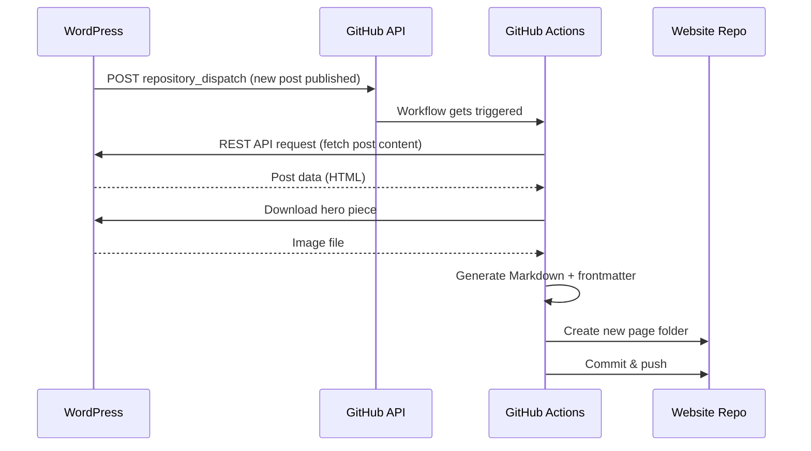

**Pipeline Description**

This pipeline transfers content from a WordPress website into the [cotedi-project](https://github.com/cotedi-project/cotedi-project.github.io) GitHub repository automatically — both already existing content (one-time migration) and new posts published going forward (ongoing sync).

1. One-time Migration of Existing Content
Before going live, all existing content currently on WordPress is fetched (via the WordPress REST API) and converted into the repo's folder structure — each existing post gets its own page folder containing a Markdown file and a hero image. This step runs once, to bring the current state of the WordPress site fully into the new repo.

1. Ongoing Sync of New Content
After that, whenever a new post is published on WordPress, the process continues automatically:

A small code snippet added to WordPress watches for when a new post gets published. It's the only piece installed directly in WordPress (e.g. in functions.php or as a small plugin), and it doesn't change any content itself — it simply notifies the outside world that something new was published.[link](https://blog.teamtreehouse.com/hooks-wordpress-actions-filters-examples)

This notification happens via a [repository_dispatch](https://github.com/marketplace/actions/repository-dispatch) — a GitHub API call that lets you trigger a GitHub Actions workflow from outside the repo itself. Think of it like a "doorbell": WordPress "rings" GitHub to say "there's something new."

This trigger starts the GitHub Actions workflow, which automatically:

- fetches the new post's content via the WordPress REST API
- generates a Markdown file in the correct format
- downloads the hero image
- creates a new page folder in the repo (same structure as the migration)
- commits and pushes everything

Read more about the [GitHub Actions workflow](https://shipyard.build/blog/your-first-python-github-action/)

